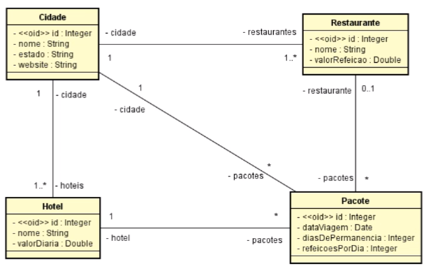

# Pacotes Turisticos 
 

# Sobre o projeto

Pacotes Turisticos é uma API REST desenvolvida com SpringFramework. Essa aplicação esta baseada nos requisitos e diagrama UML abaixo, um exercicio do curso de Modelagem de Dados com UML (DevSuperior).

## Requisitos
Deseja-se fazer um sistema para manter dados de cidades (nome, estado, website), onde
cada cidade possui um ou mais restaurantes (nome, valor da refeição) e hotéis (nome, valor da diária).
Além disso, deseja-se registrar pacotes turísticos vendidos. Para registrar um pacote turístico, deve-se
escolher uma cidade, definir a data da viagem, o hotel de hospedagem e o número de dias de
permanência. Deve-se também definir se no p

## UML - Modelo conceitual

# Tecnologias utilizadas
## Back end
- Java
- Spring Boot
- JPA / Hibernate
- Maven
- Banco de dados H2.

# Autor

William Henrique Campos

https://www.linkedin.com/in/william-henrique-campos-98568813a/

